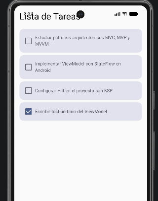
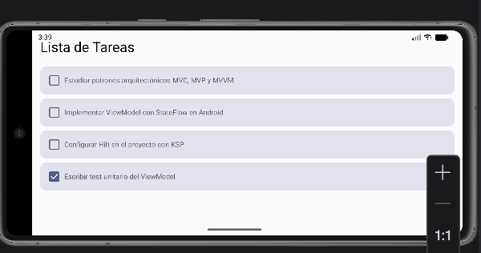
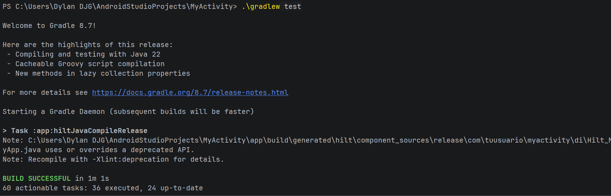

# TaskApp - Aplicación Android con MVVM, Hilt y KSP

## Descripción del proyecto

TaskApp es una aplicación Android desarrollada en Kotlin que permite gestionar tareas de forma sencilla. El proyecto implementa buenas prácticas de desarrollo utilizando arquitectura moderna basada en **MVVM (Model-View-ViewModel)**, junto con **inyección de dependencias con Hilt** y procesamiento de anotaciones mediante **KSP**.

El objetivo principal es demostrar el uso de patrones arquitectónicos, separación de responsabilidades y pruebas unitarias en Android.


## Arquitectura implementada

El proyecto sigue el patrón **MVVM**, organizado en capas:

### Model (Modelo)
Contiene las clases de datos y contratos:
- `Task.kt`
- `TaskRepository.kt`

### Data (Datos)
Implementación del repositorio:
- `FakeTaskRepository.kt`

### ViewModel
Maneja la lógica de negocio y estado de la UI:
- `TaskViewModel.kt`
- Uso de **StateFlow**

### UI (Vista)
Componentes visuales construidos con Jetpack Compose:
- Pantallas y Composables

### DI (Dependency Injection)
Configuración de Hilt:
- `RepositoryModule.kt`

## Tecnologías utilizadas

- Kotlin
- Android Studio
- Jetpack Compose
- MVVM
- Hilt (Inyección de dependencias)
- KSP (Kotlin Symbol Processing)
- StateFlow
- JUnit (Pruebas unitarias)

## Pruebas unitarias

Se implementaron pruebas unitarias para el `TaskViewModel`, verificando:

- Obtención de tareas
- Agregado de tareas
- Manejo del estado con StateFlow

Ejecución exitosa con:

## Evidencias (Checkpoints)

Las siguientes capturas demuestran el cumplimiento de los requisitos:

### Checkpoint 1


### Checkpoint 2


### Checkpoint 3


```bash
./gradlew test


